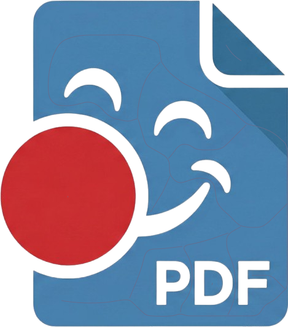

<p align="center">
  
</p>

<h1 align="center">PDFClowne</h1>

<p align="center">
  A modern Windows PDF workspace for reading, rotating, organizing, and saving documents with a clean Qt interface.
</p>

<p align="center">
  Built with <strong>Qt 6 / QML</strong> and <strong>MuPDF</strong>.
</p>

---

## What Is PDFClowne?

PDFClowne is a desktop PDF application focused on a fast, clean workflow for everyday document handling.

Open files instantly, move across pages, switch between view modes, rotate pages when a scan comes in sideways, and save those edits back to the original document or as a new copy.

It is designed to feel lightweight, readable, and practical instead of overloaded.

## Why Use It?

- Clean desktop-first PDF experience for Windows
- Multi-document workflow with tabs
- Fast zoom and page navigation
- Page rotation with persistent save
- Save back to original PDF or create a rotated copy
- Recent files history
- Light and dark visual modes

## Current Features

- Open PDF files
- Work with multiple PDFs in tabs
- Navigate page by page
- Fit page and fit width modes
- Zoom controls
- Rotate individual pages left or right
- Save changes into the original PDF
- Save a rotated copy as a new file
- Recent files panel

## Robust PDF Text Editing

PDFClowne keeps MuPDF as the main viewer/rendering engine. The optional text
editing pipeline can classify recovered text per block:

- `nativeEditable` when the original text object is safe to rewrite.
- `visualEditable` when the text is visible and editable through persistent
  visual replacement.
- `ocrEditable` when OCR is required before editing.
- `notEditable` only when no supported text or pseudo-text region is available.

Canva/Figma/Illustrator-style PDFs that expose visible text through complex
layout structures should be treated as `visualEditable`, not as "no text
found". The current persistent visual replacement uses a white mask plus new
text; complex backgrounds still need a later backdrop-tile pass.

## Product Highlights

### Clean Reading Experience

PDFClowne keeps the document front and center. The interface stays compact, the controls stay close, and the viewer is built to keep reading and quick document correction fluid.

### Practical Scan Fixing

If a PDF arrives with rotated pages, you can correct them directly in the app and save the result instead of re-exporting through external tools.

### Multi-File Workflow

Open several PDFs at once, jump between tabs, and keep your recent files close at hand.

## Keyboard Shortcuts

| Action | Shortcut |
| --- | --- |
| Open PDF | `Ctrl+O` |
| Save to original PDF | `Ctrl+S` |
| Save as new rotated copy | `Ctrl+Shift+S` |

## Tech Stack

| Layer | Technology |
| --- | --- |
| UI | Qt 6 / QML |
| Rendering and PDF editing | MuPDF |
| Build system | CMake |
| Toolchain | MSVC 2022 + Ninja |

## Requirements

| Component | Version |
| --- | --- |
| Qt | 6.5+ |
| MuPDF | Native headers and libraries |
| Visual Studio Build Tools | 2022 |
| CMake | 3.22+ |
| Ninja | Recent version |

## Environment Setup

Set Qt and MuPDF before configuring:

```powershell
$env:QT6_DIR = "C:\Qt\6.8.3\msvc2022_64"
$env:MUPDF_ROOT = "D:\Aplicaciones\mupdf"
```

`MUPDF_ROOT` must provide:

- `include\mupdf\fitz.h`
- `libmupdf.lib`
- `libthirdparty.lib`

## Build

Debug:

```powershell
cmake --preset debug-msvc
cmake --build --preset debug-msvc
```

Release:

```powershell
cmake --preset release-msvc
cmake --build --preset release-msvc
```

Binary output:

```text
build\release\PDFClowne.exe
```

## Developer Pre-Releases

This repository is prepared to publish automatic **pre-releases** from the `developer` branch.

Each push to `developer` can generate:

- a Windows release build
- a packaged zip artifact
- a GitHub pre-release tied to that build

The workflow is designed for **GitHub-hosted Windows runners** and installs its own dependencies during CI:

- Qt `6.8.3` through `jurplel/install-qt-action`
- MSVC command-line environment through `ilammy/msvc-dev-cmd`
- MuPDF built from the official `ArtifexSoftware/mupdf` repository

You can also trigger the same pipeline manually from the **Actions** tab with `workflow_dispatch`.

## Project Structure

```text
PDFClowne/
├── .github/
├── resources/
├── src/
│   ├── backend/
│   └── qml/
├── CMakeLists.txt
├── CMakePresets.json
└── README.md
```

## Roadmap técnico open source

PDFClowne evoluciona hacia una app de edición PDF completa sin usar Apryse/PDFTron ni ningún SDK comercial cerrado.

### Stack open source aprobado

| Motor | Uso |
| --- | --- |
| **MuPDF** | Motor principal: renderizado, visor, extracción de texto, anotaciones |
| **PoDoFo** | Formularios AcroForm, firma digital, manipulación profunda de PDF |
| **QPDF** | Validación, reparación, split/merge, normalización |
| **Tesseract + Leptonica** | OCR opcional para PDFs escaneados |
| **OpenSSL** | Criptografía para firma digital (PFX/P12, PAdES) |
| **LibreOffice headless** | Exportación a ODT/DOCX — opcional, futuro |

### Fases de desarrollo

| Fase | Funcionalidad |
| --- | --- |
| Fase 1 | Formularios PDF — AcroForm, checkboxes, combos, campos de firma |
| Fase 2 | Firma visual — dibujar, importar imagen, colocar en página |
| Fase 3 | Anotaciones — highlight, sticky note, shapes, freehand |
| Fase 4 | Edición visual de texto — overlays sobre bloques extraídos |
| Fase 5 | Firma digital real — PFX/P12, OpenSSL, PAdES |
| Fase 6 | OCR — Tesseract, capa de texto buscable |
| Fase 7 | Exportación — HTML estructurado → LibreOffice → ODT/DOCX |

### Dependencias opcionales en CMake

Las dependencias opcionales se desactivan automáticamente si no están instaladas:

```cmake
ENABLE_FORMS=ON               # PoDoFo — formularios AcroForm
ENABLE_SIGNATURES=ON          # firma visual y digital
ENABLE_QPDF=ON                # operaciones estructurales
ENABLE_PODOFO=ON              # manipulación profunda PDF
ENABLE_OCR=OFF                # Tesseract (requiere instalación)
ENABLE_LIBREOFFICE_EXPORT=OFF # LibreOffice headless (requiere instalación)
```

### Advertencias

- **Edición de texto PDF**: limitada por fuentes subset. Glifos fuera del subset original producen caracteres incorrectos. La app avisa cuando detecta esta situación.
- **Formularios XFA**: no soportados. Solo AcroForm estándar.
- **Conversión PDF → ODT/DOCX**: no es perfecta. Layouts complejos, imágenes y estilos pueden perderse.
- **Firma digital**: la validación completa en Acrobat requiere CRL/OCSP activos.

## Status

PDFClowne is actively evolving as a desktop PDF tool. The current focus is improving the document workflow, saving edited PDFs reliably, and polishing the Windows experience.
